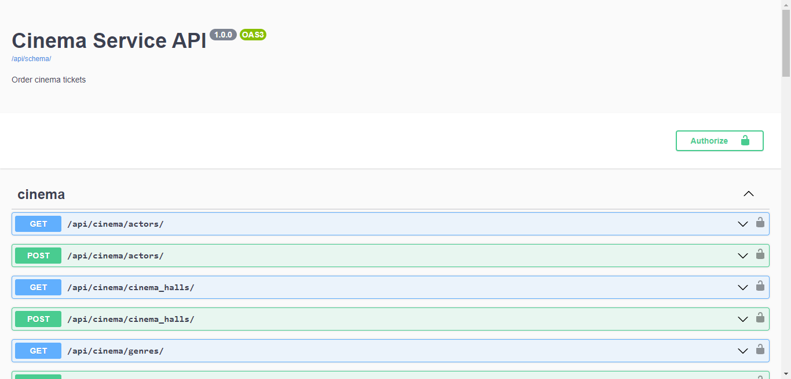
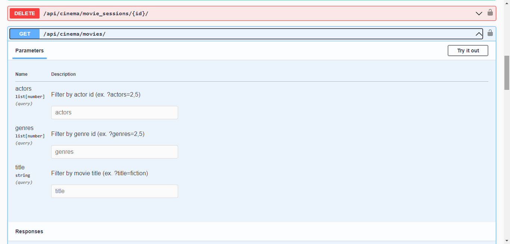
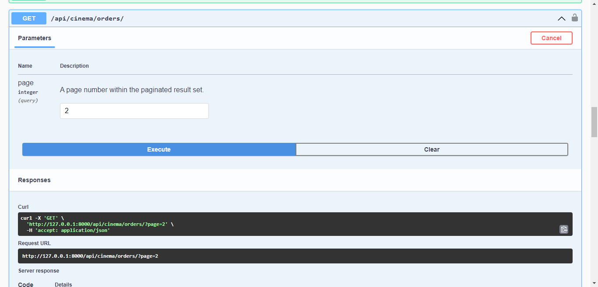

### Installation

1. Fork the repo (GitHub repository)
2. Clone the forked repo
`git clone https://github.com/oksanaaam/DRF-cinema-API.git`
3. Open the project folder in your IDE
4. Open a terminal in the project folder
5. If you are using PyCharm - it may propose you to automatically create venv for your project and install requirements in it, but if not:
```
python -m venv venv
venv\Scripts\activate (on Windows)
source venv/bin/activate (on macOS)
pip install -r requirements.txt
```

### Installation PostgreSQL and create database.
Set the required environment variables in .env.sample file:

```
SECRET_KEY=<your SECRET_KEY>
ALLOWED_HOSTS=<your ALLOWED_HOSTS>
DEBUG = <your debug>

POSTGRES_HOST=<your db hostname>
POSTGRES_DB=<your db name>
POSTGRES_USER=<your user name>
POSTGRES_PASSWORD=<your password>
```

### Run server
```
python manage.py migrate
python manage.py runserver
```

### Run with docker
Docker should be installed
```
docker-compose build
docker-compose up
```

### Getting access
Create a new user following http://localhost:8000/api/user/register/

Get an access token from the following URL http://localhost:8000/api/user/token/

### Features
• JWT authenticated Admin panel /admin/

• Documentation is located at /api/doc/swagger/

• Managing orders and tickets

• Creating movies with genres, actors

• Creating cinema

• Adding movie sessions

• Filtering movies and movie sessions

### API Documentation
API documentation is technical content that describes the movie API in detail:

Swagger UI: http://localhost:8000/api/doc/swagger/

Screenshots from swagger showing the available endpoints:



Filtering movies by title, genre and actors


Set count orders, which will be shown on one page

